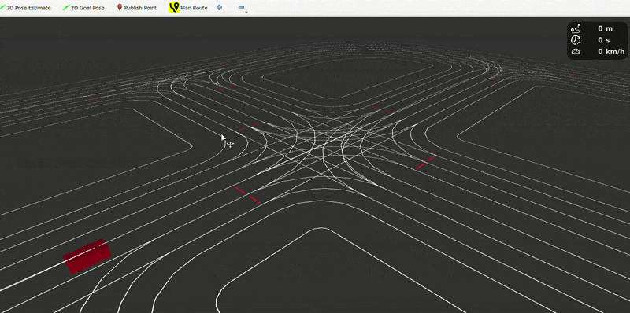

# lanelet2_route_planning

<p align="center">
  <a href="https://github.com/openads-project"></a>
  <a href="https://www.ros.org"></a>
  <a href="https://github.com/openads-project/lanelet2_route_planning/releases/latest"></a>
  <a href="https://github.com/openads-project/lanelet2_route_planning/blob/main/LICENSE"></a>
  <br>
  <a href="https://github.com/openads-project/lanelet2_route_planning/actions/workflows/docker-ros.yml"></a>
  <a href="https://github.com/openads-project/lanelet2_route_planning/actions/workflows/compose-oci.yml"></a>
  <a href="https://openads-project.github.io/lanelet2_route_planning"></a>
  <a href="https://github.com/openads-project/lanelet2_route_planning/actions/workflows/consistency.yml"></a>
</p>

**ROS 2 Route Planning for Automated Driving based on Lanelet2**

The [lanelet2_route_planning](lanelet2_route_planning/README.md) node plans a (shortest path) route to a destination based on [Lanelet2](https://github.com/fzi-forschungszentrum-informatik/Lanelet2) map. It runs a ROS action server that accepts a destination, plans a route, and continuously publishes feedback on the route progress to the action client. The [plan_route_action_client](plan_route_action_client/README.md) node can be used alongside as a standard action client, e.g., by listening to goal poses published from RViz. The suggested way of interactively planning routes is to use the [PlanRouteTool](https://github.com/ika-rwth-aachen/planning_interfaces/tree/main/route_planning_msgs_rviz_plugins) RViz tool plugin.

<p align="center">
  <strong>🚀 <a href="#-quick-start">Quick Start</a></strong> • <strong>💻 <a href="#-development">Development</a></strong> • <strong>📝 <a href="#-documentation">Documentation</a></strong>
</p>

> [!IMPORTANT]
> This repository is part of [***OpenADS***](https://openads-project.github.io/), the *Open Automated Driving Systems* project. *OpenADS* and its modules have been initiated and are currently being maintained by the [**Institute for Automotive Engineering (ika) at RWTH Aachen University**](https://www.ika.rwth-aachen.de/de/).

## 🚀 Quick Start



1. Launch the [`demo/docker-compose.yml`](demo/docker-compose.yml) setup. This will open RViz with a visualization of a Lanelet2 map.
    ```bash
    cd demo
    xhost +local: # allow GUI forwarding from containers
    docker compose up -d
    ```
2. Select the *Plan Route* tool in RViz and click on a destination on the map to plan a route, which will be visualized as a green line.
3. Stop the demo and clean up.
    ```bash
    docker compose down
    xhost -local: # revoke GUI forwarding permissions
    ```

## 💻 Development

### Set up Development Environment

1. Clone the repository.
    ```bash
    git clone https://github.com/openads-project/lanelet2_route_planning.git
    ```
1. Initialize the [`.openads-dev-environment`](https://github.com/openads-project/openads-dev-environment) submodule containing development environment configuration.
    ```bash
    cd lanelet2_route_planning
    git submodule update --init --recursive
    ```
1. Open the repository in [Visual Studio Code](https://code.visualstudio.com).
    ```bash
    code .
    ```
1. Install the recommended VS Code extensions.
    > *Ctrl+Shift+P / Extensions: Show Recommended Extensions / Install Workspace Recommended Extensions (Cloud Download Icon)*
1. Reopen the repository in a [Dev Container](https://code.visualstudio.com/docs/devcontainers/containers).
    > *Ctrl+Shift+P / Dev Containers: Rebuild and Reopen in Container*

### Build

> *Ctrl+Shift+B*

```bash
colcon build
```

### Run Tests

> *Ctrl+Shift+P / Tasks: Run Test Task*

```bash
colcon build --cmake-args -DCMAKE_EXPORT_COMPILE_COMMANDS=1
colcon test
colcon test-result --verbose
```


## 📝 Documentation

Package and node interfaces are documented in the respective package READMEs listed below. Implementation details are found in the [Source Code Documentation](https://openads-project.github.io/lanelet2_route_planning).

| Package | Description |
| --- | --- |
| [lanelet2_route_planning](lanelet2_route_planning/README.md) | Plans a route on a Lanelet2 map |
| [plan_route_action_client](plan_route_action_client/README.md) | Action client to plan a route_planning_msgs/action/Route based on clicked RViz poses or other inputs |

## ⚖️ Licensing

The source code in this repository is licensed under Apache-2.0, see [LICENSE](LICENSE). Container images provided by this repository may contain third-party software shipped with their own license terms.

## 🙏 Acknowledgements

Development and maintenance of this repository are supported by the following projects. We acknowledge the funding of the respective institutions.

| Project | Funding Institution | Grant Number |
| --- | --- | --- |
| [6GEM+](https://6gem.de) | 🇩🇪 Federal Ministry for Research, Technology and Space (BMFTR) | 16KIS2409K |
| [6GEM](https://6gem.de) | 🇩🇪 Federal Ministry for Research, Technology and Space (BMFTR) | 16KISK036K |
| [AIthena](https://aithena.eu/) | 🇪🇺 European Union | 101076754 |

<p>
  
  
</p>

<sub><sup>Funded by the European Union. Views and opinions expressed are however those of the author(s) only and do not necessarily reflect those of the European Union or the European Climate, Infrastructure and Environment Executive Agency (CINEA). Neither the European Union nor CINEA can be held responsible for them.</sup></sub>
