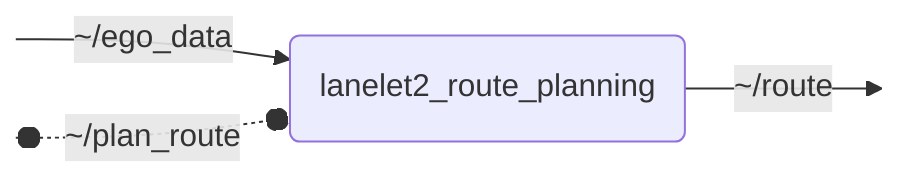

# `lanelet2_route_planning`

Plans a route on a Lanelet2 map

- [Nodes](#nodes)
  - [lanelet2_route_planning](#lanelet2_route_planning)
- [Launch Files](#launch-files)

## Nodes

### `lanelet2_route_planning`

The `lanelet2_route_planning` node computes a shortest path route from a current ego position to a destination based on a Lanelet2 map. Progress along the route is continuously tracked and published as action feedback via the integrated action server, which is accepting a destination in the first place. The route is published at a constant frequency, allowing downstream planning tasks to incorporate knowledge about the road topology. For this purpose, the published route not only contains a suggested reference line, but also information about adjacent lanes, regulatory elements, and drivable space. For the sake of computation and data efficiency, the route is only locally enriched with this additional information. More information on the outgoing `route_planning_msgs/msg/Route` format is found in [planning_interfaces](https://github.com/ika-rwth-aachen/planning_interfaces?tab=readme-ov-file#overview-of-the-route_planning_msgs).

#### Subscribed Topics

| Topic | Type | Description |
| --- | --- | --- |
| `~/ego_data` | `perception_msgs/msg/EgoData` | ego data |

#### Published Topics

| Topic | Type | Description |
| --- | --- | --- |
| `~/route` | `route_planning_msgs/msg/Route` | planned route |

#### Action Servers

| Action | Type | Description |
| --- | --- | --- |
| `~/plan_route` | `route_planning_msgs/action/PlanRoute` | plans route to destination |

#### Parameters

| Parameter | Type | Default | Description |
| --- | --- | --- | --- |
| `ll2_map_server_name` | `string` | `"lanelet2_map_server"` | Name of lanelet2_map_server node |
| `publish_frequency` | `float` | `10.0` | Frequency of route publication [Hz] |
| `action_feedback_frequency` | `float` | `1.0` | Frequency of action feedback publication [Hz] |
| `sampling_distance` | `float` | `1.0` | Distance between resampled points along route [m] |
| `project_destination_to_reference_line` | `bool` | `true` | Whether to project destination to reference line |
| `destination_distance_threshold` | `float` | `1.0` | Distance to destination where destination is considered reached [m] |
| `required_traveled_distance_proportion` | `float` | `0.5` | Proportion of route length that must have been traveled before considering destination reached [0..1] |
| `enrich_route_ahead_ego_distance` | `float` | `100.0` | Distance ahead of ego position where global route is enriched with more information [m] (negative=unlimited) |
| `enrich_route_behind_ego_distance` | `float` | `10.0` | Distance behind ego position where global route is enriched with more information [m] (negative=unlimited) |
| `route_undershoot_distance` | `float` | `0.0` | Undershoot route by this distance before ego position [m] |
| `route_overshoot_distance` | `float` | `0.0` | Overshoot route by this distance behind destination [m] |
| `max_drivable_space_radius` | `float` | `50.0` | Maximum distance to left/right drivable space bounds, if not otherwise restricted [m] |
| `max_num_threads` | `int` | `0` | Maximum number of threads for parallel processing (0=max available) |
| `transform_timeout` | `float` | `0.02` | How long to wait for a transform to be available [s] |

## Launch Files

### [`lanelet2_route_planning_launch.py`](launch/lanelet2_route_planning_launch.py)

| Argument | Default | Description |
| --- | --- | --- |
| `ego_data_topic` | `"~/ego_data"` |  |
| `route_topic` | `"~/route"` |  |
| `name` | `"lanelet2_route_planning"` | node name |
| `namespace` | `""` | node namespace |
| `params` | `os.path.join(get_package_share_directory("lanelet2_route_planning"), "config", "params.yml")` | path to parameter file |
| `log_level` | `"info"` | ROS logging level (debug, info, warn, error, fatal) |
| `use_sim_time` | `"false"` | use simulation clock |

### [`lanelet2_route_planning_with_action_client_launch.py`](launch/lanelet2_route_planning_with_action_client_launch.py)

| Argument | Default | Description |
| --- | --- | --- |
| `ego_data_topic` | `"~/ego_data"` | ego data topic |
| `route_topic` | `"~/route"` | planned route topic |
| `goal_pose_topic` | `"/goal_pose"` | goal pose topic |
| `name` | `"lanelet2_route_planning"` | node name |
| `namespace` | `""` | node namespace |
| `params` | `os.path.join(get_package_share_directory("lanelet2_route_planning"), "config", "params.yml")` | path to parameter file |
| `log_level` | `"info"` | ROS logging level (debug, info, warn, error, fatal) |
| `use_sim_time` | `"false"` | use simulation clock |
