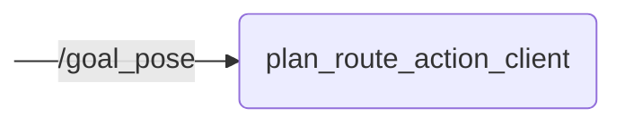

# `plan_route_action_client`

Action client to plan a route_planning_msgs/action/Route based on clicked RViz poses or other inputs

- [Nodes](#nodes)
  - [plan_route_action_client](#plan_route_action_client)

## Nodes

### `plan_route_action_client`

#### Subscribed Topics

| Topic | Type | Description |
| --- | --- | --- |
| `/goal_pose` | `geometry_msgs/msg/PoseStamped` | |

#### Action Clients

| Action | Type | Description |
| --- | --- | --- |
| `/planning/lanelet2_route_planning/plan_route` | `route_planning_msgs/action/PlanRoute` | |

#### Parameters

| Parameter | Type | Default | Description |
| --- | --- | --- | --- |
| `ll2_map_server_name` | `string` | `"ll2_map_server"` | Name of lanelet2_map_server node |
| `waypoints` | `string[]` | `[]` | List of WGS84 waypoints to endlessly follow (list of strings with comma-separated '<LATITUDE>,<LONGITUDE>') |
| `enable_random_destination` | `bool` | `false` | Whether to plan a route to a random destination |
| `enable_continuous_planning` | `bool` | `false` | Whether to continuously plan a new route (either to the next waypoint or to a random destination) |
| `cancel_route` | `bool` | `false` | Cancel active route planning action (to be set at runtime) |
