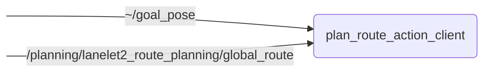

# `plan_route_action_client`

Action client to plan a route_planning_msgs/action/Route based on clicked RViz poses or other inputs

- [Nodes](#nodes)
  - [plan_route_action_client](#plan_route_action_client)

## Nodes

### `plan_route_action_client`

The `plan_route_action_client` node is an action client interacting with the `lanelet2_route_planning` action server. It primarily offers three different modes of route planning:
1. goal pose subscriber: plans a route to a `/goal_pose` published by RViz's goal pose plugin; the suggested way of interactively planning routes in RViz is to use the [PlanRouteTool](https://github.com/ika-rwth-aachen/planning_interfaces/tree/main/route_planning_msgs_rviz_plugins) RViz tool plugin though
2. waypoints: plans routes to pre-defined waypoints, one after the other; with continuous planning enabled, already passed waypoints are moved to the end of the route once the configured route proportion is reached, allowing the vehicle to drive the waypoints as a closed loop without stopping (waypoints with a positive `WAIT_TIME_S` remain designated stops: each is reached as a route destination and its configured wait time is completed before planning continues)
3. random: plans a route to a random destination on the map

```mermaid
flowchart LR
    NODE("plan_route_action_client")
    S0:::hidden -->|~/goal_pose| NODE
    S1:::hidden -->|/planning/lanelet2_route_planning/global_route| NODE
    classDef hidden display: none;
```

#### Subscribed Topics

| Topic | Type | Description |
| --- | --- | --- |
| `~/goal_pose` | `geometry_msgs/msg/PoseStamped` | goal pose (clicked in RViz) |
| `/planning/lanelet2_route_planning/global_route` | `route_planning_msgs/msg/Route` | complete route used to detect passed waypoints |

#### Action Clients

| Action | Type | Description |
| --- | --- | --- |
| `/planning/lanelet2_route_planning/plan_route` | `route_planning_msgs/action/PlanRoute` | plans route to destination |

#### Parameters

| Parameter | Type | Default | Description |
| --- | --- | --- | --- |
| `ll2_map_server_name` | `string` | `"ll2_map_server"` | Name of lanelet2_map_server node |
| `waypoints` | `string[]` | `[]` | List of WGS84 waypoints to follow (list of strings with comma-separated '<LATITUDE>,<LONGITUDE>[,<WAIT_TIME_S>]', missing wait time defaults to 0s, negative wait time means intermediate destination) |
| `enable_random_destination` | `bool` | `false` | Whether to plan a route to a random destination |
| `enable_continuous_planning` | `bool` | `false` | Whether to continuously plan a new route (either looping waypoints or to a random destination) |
| `continuous_planning_replanning_proportion` | `float` | `0.6` | Traveled route proportion at which continuous waypoint replanning starts |
| `cancel_route` | `bool` | `false` | Cancel active route planning action (to be set at runtime) |
